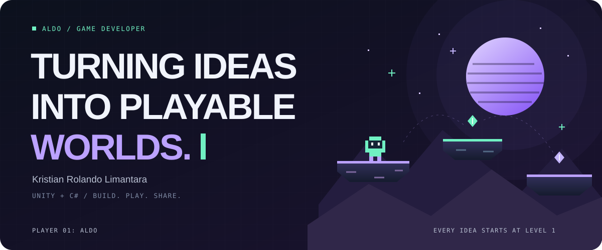
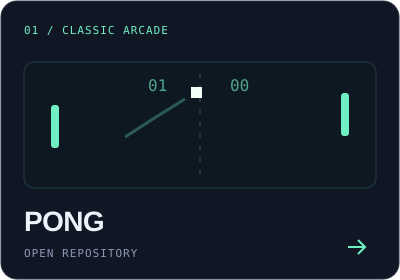
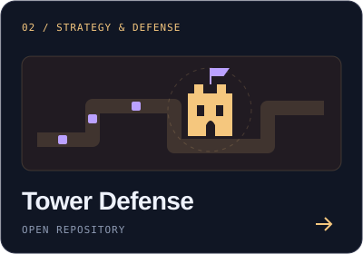
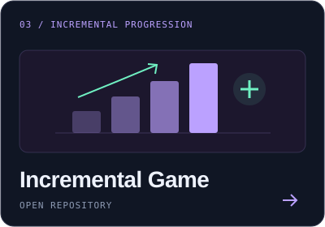
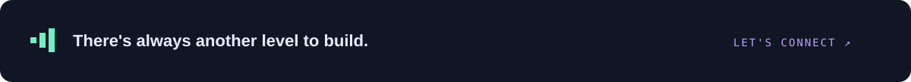

  

  <a href="#player-profile">Player profile</a> &nbsp; / &nbsp;
  <a href="#project-select">Project select</a> &nbsp; / &nbsp;
  <a href="#the-loadout">The loadout</a> &nbsp; / &nbsp;
  <a href="#next-level">Let's connect</a>

## Player profile

Hey, I'm **Aldo** — **Kristian Rolando Limantara**. I work in game development, build with **Unity and C#**, and enjoy helping people learn.

For me, game development brings together two things I love: **making something playable** and **sharing the discoveries along the way**.

<table>
  <tr>
    <td width="33%" valign="top"><strong>01 / BUILD</strong>  Turning ideas into games and exploring what makes them fun.</td>
    <td width="33%" valign="top"><strong>02 / EXPLORE</strong>  Trying different genres, mechanics, and development tools.</td>
    <td width="33%" valign="top"><strong>03 / SHARE</strong>  Teaching, exchanging ideas, and learning together.</td>
  </tr>
</table>

## Project select

**Pick a project. Explore the code.** Here are a few public repositories from my game development journey.

<table>
  <tr>
    <td width="33%" align="center" valign="top">
       
      <a href="https://github.com/kristianrolando/PONG"><strong>Explore PONG →</strong></a>
    </td>
    <td width="33%" align="center" valign="top">
       
      <a href="https://github.com/kristianrolando/Tower-Defense"><strong>Explore Tower Defense →</strong></a>
    </td>
    <td width="33%" align="center" valign="top">
       
      <a href="https://github.com/kristianrolando/Incremental-Game"><strong>Explore Incremental Game →</strong></a>
    </td>
  </tr>
</table>

Custom illustrated covers inspired by each genre.

<a href="https://github.com/kristianrolando?tab=repositories&amp;type=public"><strong>View the full project collection ↗</strong></a>

## The loadout

The tools I bring to the game development process.

<table>
  <tr>
    <th align="left" width="33%">Engine &amp; languages</th>
    <th align="left" width="33%">Version control</th>
    <th align="left" width="33%">Services</th>
  </tr>
  <tr>
    <td valign="top">
       
      
      
    </td>
    <td valign="top">
       
      
    </td>
    <td valign="top">
      
    </td>
  </tr>
</table>

## Next level

Game development, learning, or a good conversation about games — **let's exchange ideas.**

  
  

  

